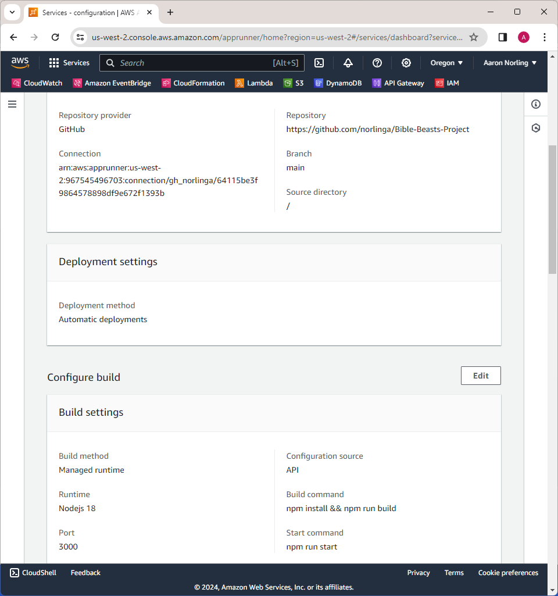
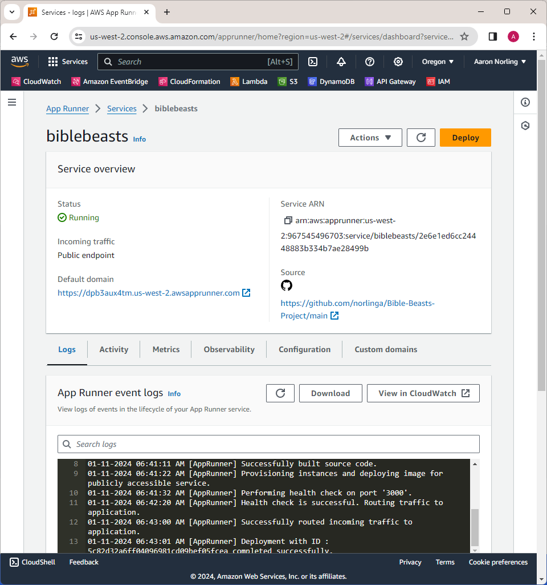

# Deploying to AWS

> This section got less time and attention as I was starting to run up against the time limit.

The Readme specifies that Spruce **really** wants Bible-Beasts to be deployed to a container service in AWS.
There's obviously a number of options to do this within AWS.
Before making a final decision on what to do I'd ideally like to ask a few questions with Spruce to understand the operational need.
In partnership with Spruce, deciding the platform choice could go in a number of directions.

Or maybe we have a platform that we've selected and standardized on and there's not really much conversation to be had.  :)

## I went on a side quest

Given the simplicity of Spruce's application I initially considered, and actually got everything running, in AppRunner.

[Bible Beasts](https://dpb3aux4tm.us-west-2.awsapprunner.com/)

This approach was a bit of a cheat.
The Readme specifies that the service should run that app as a container.
While I had succeeded in building containers in GHCR, it wasn't going to be straightforward to get AppRunner to pull freshly-made images from Github.
While the application was easy enough to deploy, and redeploys on changes to main in the Github project, this represents a fun side quest and not a success according to the requirement.
Also, I didn't configure the AppRunner programmatically, though the app technically could have been provisioned through an `apprunner.yml`.

Configuring AppRunner was dead simple:



While not a good solution for Spruce, as I had configured it, AppRunner was interesting:



Note in particular the logs present on the home screen.
Cool!
I'm fixated on this point given the experience I had with...

## Copilot

Fargate and a few other approaches to containers seemed like they might also be good fits for Spruce, but I ended up settling on Copilot.
I have it on good authority that Copilot has some really interesting, cool ideas.
There were parts of Copilot that I was impressed by but ultimately I ran out of time to make it all work.
Here's where I've left things:

Copilot gave me this:

http://bibleb-publi-uctrrow4st2l-1111020264.us-west-2.elb.amazonaws.com/app

which leads to a 404 - makes sense given that the `app` route isn't something I fed Copilot.
Removing the `app` route gives a more generic 503:

http://bibleb-publi-uctrrow4st2l-1111020264.us-west-2.elb.amazonaws.com/

This makes me suspicious that I didn't quite get the configuration right when I set up Copilot.
I followed a few paths trying to debug using the `copilot` cli tool, with the only feedback in the service logs as follows:

```
% copilot svc logs --follow
copilot/ecs-service-conne [2024-01-11 22:43:24.198][38][info][upstream] [source/common/upstream/cds_api_helper.cc:32] cds: add 2 cluster(s), remove 0 cluster(s)
copilot/ecs-service-conne [2024-01-11 22:43:24.198][38][info][upstream] [source/common/upstream/cds_api_helper.cc:69] cds: added/updated 0 cluster(s), skipped 2 unmodified cluster(s)
```

There's a lot to say around making Copilot a useful tool for Spruce.
My gut reaction was... it was a lot.
If this is part of Spruce's development work flow (providing a build for integration testing, staging, or whatever else), this would be pretty disappointing just in how slow the whole stack is to provision.
And if Spruce was worried about slow local builds of a Docker image, this might not be it.
On the other hand, if Spruce is looking for production-grade infrastructure - getting Copilot to work as intended might in fact be the move.

## Conclusion

Copilot's probably rad but I didn't get a working implementation in time, and it's also probably not the right tool for Spruce at any rate.
